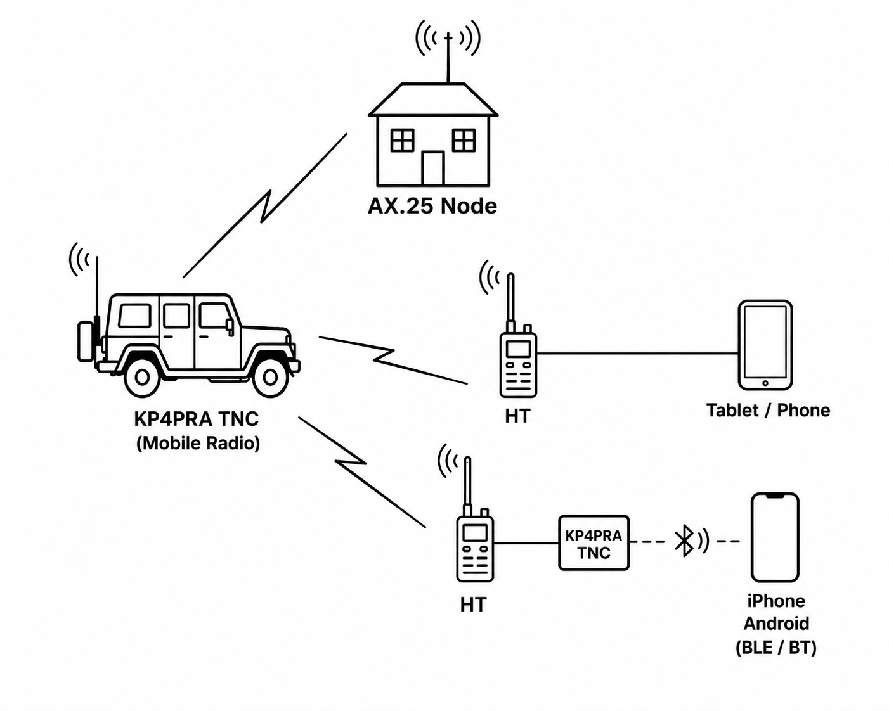

# KP4PRA TNC

**Bluetooth KISS TNC bridge and web management interface for Orange Pi /
Raspberry Pi running [Dire Wolf](https://github.com/wb2osz/direwolf).**

Turns a small single-board computer with a USB radio interface into a
field-ready APRS TNC that phones connect to over Bluetooth — with a web
UI for setup, pairing, Dire Wolf configuration, and live traffic
monitoring. Designed for unattended operation on a read-only filesystem
with no persistent logs (SD-card friendly).

Provides Bluetooth Low Energy (BLE) connectivity for iPhone APRS
applications such as APRS.fi and other applications that require BLE
communication, while also providing seamless Bluetooth pairing for
Android devices. KP4PRA TNC is compatible with applications including
WOAD, APRSDroid, APRS.fi, and RadioMail. It supports multiple radio and
sound-card interfaces, including CM108-based devices, DigiRig Lite,
Mobilink, and additional interfaces currently being implemented.

Built by KP4PRA/KP3M Heber Soto — np4jn@outlook.com

## What it does
Android (APRSDroid) ──RFCOMM/SPP──┐
├──> KISS TCP :8001 ──> Dire Wolf ──> Radio
iPhone (aprs.fi) ──BLE KISS GATT──┘         ▲
│
WiFi/LAN APRS apps ── DNS-SD discovery ─────┘
Browser ──> http://<host>/ (port 80→8088) ──> Web management UI

- **Android** pairs over Bluetooth Classic (Just Works — no PIN) and
  APRSDroid connects via RFCOMM/SPP.
- **iPhone** connects from inside aprs.fi over BLE KISS GATT — no iOS
  pairing, no reboot, using the standard KISS-over-BLE UUIDs.
- **Both bridges** pass raw KISS binary, auto-reconnect if Dire Wolf
  restarts, and survive idle periods (no traffic ≠ disconnect).
- **WiFi access point (field mode)**: the TNC can broadcast its own
  network (default SSID KP4PRA) so a phone joins it directly and reaches
  the web UI at http://172.16.0.1/ - no home WiFi needed. Switchable
  between client and AP modes; NetworkManager-based.
- **Web UI** (FastAPI + Jinja2, mobile-friendly): dashboard with live
  status, Bluetooth pairing wizards for Android and iPhone, service
  control (bridges + Dire Wolf), live Dire Wolf traffic view, and a
  configuration page.
- **Station Information → direwolf.conf**: callsign/SSID, grid,
  lat/lon, sound card (live detection incl. Yaesu FT-991A / Signalink /
  CM108 disambiguation), PTT method (CM108 GPIO, serial RTS/DTR, VOX,
  GPIO pin), CDIGIPEAT alias — Preview and Apply regenerates
  direwolf.conf and restarts Dire Wolf; bridges reconnect automatically.

## Appliance design principles

- **Read-only root** in production; all persistent state on a small
  `/rw` partition (config, BlueZ pairing data via bind mount over
  /var/lib/bluetooth).
- **No persistent logs** — journald is volatile (RAM), status is read
  from live system state, nothing is written during normal operation.
- **Strictly allowlisted privileges** — the web service can only run
  specific systemctl/helper commands via narrow sudoers rules; no
  arbitrary command execution.
- **Self-healing** — ADEVICE re-detected at boot (USB renumbering),
  Dire Wolf auto-restart on failure, permission repair after pairing.

## Repository layout

| Path | Contents |
|---|---|
| `src/common/` | Config, BlueZ management, filesystem/service control, direwolf.conf generator, runtime status |
| `src/rfcomm/` | RFCOMM/SPP bridge (Android) — built-in socket AF_BLUETOOTH, no PyBluez |
| `src/ble/` | BLE KISS GATT bridge (iPhone) — dbus-next |
| `src/web/` | FastAPI app + Jinja2 templates (green/white theme, CSS variables) |
| `systemd/` | Service units: bridges, web, pairing agent, Dire Wolf, ADEVICE fix, BlueZ bind mount, perms fix |
| `bin/` | Helper scripts (remount rw/ro, BlueZ perms, ADEVICE fix) |
| `sudoers.d/` | Allowlisted sudo rules |
| `config/` | Example config.yaml, tmpfiles rule |
| `scripts/` | install.sh (stage 1), install-direwolf-integration.sh (stage 2), sync-from-system.sh |

## Installation

See **[INSTALL.md](INSTALL.md)** — from blank SD card to working TNC on
Orange Pi Zero 2W or Raspberry Pi Zero 2 W.

## Change history

See **[CHANGES.md](CHANGES.md)** for every fix from on-device bring-up
(Python 3.13, BlueZ 5.7x, Debian trixie) and the reasoning behind each.

## Hardware validated

Boards:
- **Orange Pi Zero 2W** (1GB, Unisoc UWE5622 WiFi5/BT5.0) — Debian trixie,
  Python 3.13, BlueZ 5.7x. Reference unit: full RFCOMM + BLE, on RF.
- **Raspberry Pi 3 Model B+** (CYW43455, BT 4.2) — Raspberry Pi OS Lite
  32-bit Bookworm, Python 3.11, BlueZ 5.66, kernel 6.12.9x. Full automated
  install validated (chained stage 2, port-80 redirect). BLE works via the
  legacy raw-HCI advertising fallback (current Pi kernels carry the
  June-2026 MGMT regression); iPhone traffic and Android provisioning
  confirmed.
- **Raspberry Pi Zero 2 W Rev 1.0** (quad-core, 512MB) — Raspberry Pi OS
  Lite 32-bit, Debian 13 trixie, kernel 6.18.34-v7 (affected by the MGMT
  regression; legacy raw-HCI fallback active). Fully validated: automated
  install, BLE with iPhone aprs.fi (incl. 20h soak and WiFi-AP
  coexistence), Android RFCOMM provisioning incl. remove + reboot path,
  KP4PRA hotspot mode. Note: the board silkscreen's tiny "2 W" is easily
  misread as an original Zero W — `cat /proc/device-tree/base/model` (or
  /sys/firmware/devicetree/base/model) is authoritative.
- **Raspberry Pi Zero W Rev 1.1** (BCM43438, BT 4.1, ARMv6 512MB) —
  Raspberry Pi OS Lite 32-bit, kernel 6.18-rpt (affected by the MGMT
  regression). Full BLE operational via the legacy raw-HCI fallback with
  capability-bearing tool copies; iPhone aprs.fi traffic confirmed.
  Android/RFCOMM works. Low-memory caveats in INSTALL.md; fine as a
  single-user unit, the Zero 2 W or Orange Pi is more comfortable.

Radios / audio:
- CM108 USB sound dongle with HID PTT
- AIOC (All-In-One-Cable) - validated ADEVICE plughw:AllInOneCable,0
- Yaesu FT-991A (USB audio codec + CP210x serial pair, PTT via RTS)

Clients:
- Android APRSDroid (Bluetooth RFCOMM/SPP)
- iPhone aprs.fi (BLE KISS)

## Status / roadmap

Working: both Bluetooth paths bidirectional, web provisioning end to
end, Dire Wolf generation/control/traffic view.
Next: production hardening (zram + read-only root switch), Clock Source
Station stage.

## License

MIT — see [LICENSE](LICENSE). Free to use, modify, and share; attribution
appreciated. 73 de KP4PRA.
